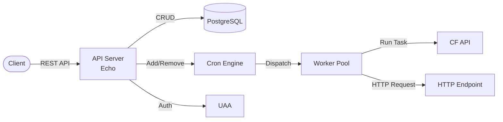

# OCF Scheduler

A standalone Go service that provides cron-style scheduling for Cloud Foundry applications.
It enables users to schedule CF tasks (jobs) and HTTP calls using cron expressions with timezone support.

## Features

- Schedule Cloud Foundry tasks (jobs) to run on cron expressions

- Schedule HTTP calls to run on cron expressions

- Timezone-aware scheduling with RFC 9636 timezone support

- Execution history tracking for both jobs and calls

- Configurable worker pool for concurrent execution

- Automatic cleanup of old execution records

- UAA-based authentication and authorization

## Architecture



On startup, the scheduler loads all enabled schedules from PostgreSQL and registers them with the cron engine.
When a schedule fires, the cron engine dispatches the work to the worker pool,
which either creates a CF task via the CF API or makes an HTTP call to the configured endpoint.

## Getting Started

### Prerequisites

- Go 1.25+

- PostgreSQL

- Cloud Foundry deployment with UAA

### Configuration

| Variable | Required | Default | Description |
|---|---|---|---|
| `DATABASE_URL` | Yes | | PostgreSQL connection string |
| `CF_ENDPOINT` | Yes | | Cloud Foundry API URL |
| `UAA_ENDPOINT` | Yes | | UAA server URL |
| `CLIENT_ID` | Yes | | UAA client ID |
| `CLIENT_SECRET` | Yes | | UAA client secret |
| `SCHEDULER_PORT` | No | `8000` | HTTP listen port |
| `SCHEDULER_WORKERS` | No | `20` | Worker pool size (minimum 10) |
| `LOG_LEVEL` | No | `info` | Log level |

### Building

```sh
make build        # Build for current platform
make release      # Build for all target platforms
make test         # Run tests
make clean        # Remove built executables
```

## API Reference

### Jobs

| Method | Path | Description |
|---|---|---|
| POST | `/jobs?app_guid=` | Create a job |
| GET | `/jobs?space_guid=` | List all jobs in a space |
| GET | `/jobs/:guid` | Get a job |
| DELETE | `/jobs/:guid` | Delete a job |
| POST | `/jobs/:guid/execute` | Execute a job immediately |

### Job Schedules

| Method | Path | Description |
|---|---|---|
| POST | `/jobs/:guid/schedules` | Create a schedule for a job |
| GET | `/jobs/:guid/schedules` | List schedules for a job |
| DELETE | `/jobs/:guid/schedules/:schedule_guid` | Delete a job schedule |

### Job Executions

| Method | Path | Description |
|---|---|---|
| GET | `/jobs/:guid/history` | List execution history for a job |
| GET | `/jobs/:guid/schedules/:schedule_guid/history` | List execution history for a job schedule |

### Calls

| Method | Path | Description |
|---|---|---|
| POST | `/calls?app_guid=` | Create a call |
| GET | `/calls?space_guid=` | List all calls in a space |
| GET | `/calls/:guid` | Get a call |
| DELETE | `/calls/:guid` | Delete a call |
| POST | `/calls/:guid/execute` | Execute a call immediately |

### Call Schedules

| Method | Path | Description |
|---|---|---|
| POST | `/calls/:guid/schedules` | Create a schedule for a call |
| GET | `/calls/:guid/schedules` | List schedules for a call |
| DELETE | `/calls/:guid/schedules/:schedule_guid` | Delete a call schedule |

### Call Executions

| Method | Path | Description |
|---|---|---|
| GET | `/calls/:guid/history` | List execution history for a call |
| GET | `/calls/:guid/schedules/:schedule_guid/history` | List execution history for a call schedule |

### Other

| Method | Path | Description |
|---|---|---|
| GET | `/` | Health check |
| GET | `/scheduler-time-zones` | List available timezones |

## Contributing

Issues and pull requests are welcome at [github.com/cloudfoundry-community/ocf-scheduler](https://github.com/cloudfoundry-community/ocf-scheduler). Please target the `develop` branch for PRs.
